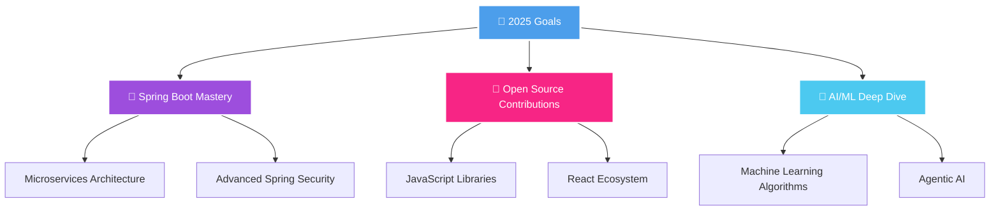

# 🌸 Sakshi Pharande

<div align="center">
  <div>
    
    
    
  </div>
<div>
  
</div>
</div>

## 🎮 About This Developer

<div align="center">

</div>

```javascript
const sakshi = {
    🌍 location: "Pune, India",
    🎯 role: "Software Engineer & Problem Solver",
    💡 currentMission: "Building amazing web experiences",
    📚 learning: ["Advanced React", "Spring Boot Mastery", "AI/ML"],
    🎨 hobbies: ["Reading", "Creative Writing", "Tech Exploration"],
    ☕ fuelBy: "Tea + Code + Curiosity",
    
    dailyRoutine: () => {
        return "Wake up ➡️ Code ➡️ Learn ➡️ Build ➡️ Repeat 🔄";
    },
    
    lifePhilosophy: "You are the one who knows you best! ✨"
};
```

<div align="center">

</div>

## 🛠️ My Developer Toolkit

<div align="center">

### 💻 Languages & Core Technologies


### 🎨 Frontend Development


### ⚙️ Backend & Frameworks


### 🔗 APIs & Communication


### ☁️ Cloud & DevOps


### 🛠️ Development Tools


</div>

## 🎯 Project Showcase

<div align="center">

<table>
<tr>
<td align="center" width="50%">

### 📚 [BookSwapStore](https://github.com/uniquesp/Book-Swap-Store)


**Online Book Marketplace**
- 🛒 Buy & Sell Books
- 🔐 User Authentication  
- 💳 Payment Integration
- 📊 Inventory Management

`Java` `Servlet-JSP` `Javascript` `Mysql`  `Bootstrap`

</td>
<td align="center" width="50%">

### 💰 [Cryptoverse](https://github.com/uniquesp/cryptoverse)


**Crypto Tracking App**
- 📈 Real-time Data
- 📊 Interactive Charts
- 📱 Responsive Design
- 🔍 Search & Filter

`React` `APIs` `Charts.js`

</td>
</tr>
<tr>
<td align="center" width="50%">

### ✅ [GetDone](https://github.com/uniquesp/GetDone)


**Smart Task Manager**
- 🎯 Priority Sorting
- ⏰ Deadline Tracking
- 📈 Progress Visualization
- 💾 Local Storage

`ExpressJs` `NodeJS` `HTML/CSS` 

</td>
<td align="center" width="50%">

### 💳 [FinTrack](https://github.com/uniquesp/FinTrack)


**Personal Finance Tool**
- 💰 Expense Tracking
- 📊 Budget Analysis
- 📈 Financial Reports
- 🎯 Goal Setting

`C++` `Console App` 

</td>
</tr>
</table>

</div>

## 📊 GitHub Stats Universe

<div align="center">


</div>

<div align="center">

</div>

## 🎯 2025 Mission Control



## 🤝 Let's Connect & Build Something Amazing!

<div align="center">

 **I'm always open to interesting conversations and collaboration opportunities!**

[](https://www.linkedin.com/in/uniquesp/)
[](mailto:uniquesp13@gmail.com)
[](https://github.com/uniquesp)
[](https://sakshi-portfolio-eight.vercel.app/)


### 💭 **"Code is like humor. When you have to explain it, it's bad." - Cory House**


</div>

---
</div>
